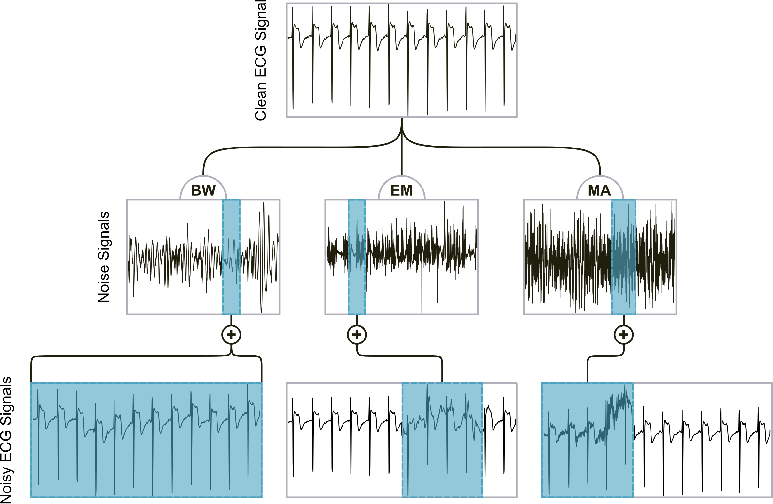

# ECG Signal Noise Removal with Bidirectional GRU

This repository contains a PyTorch implementation of a gated recurrent unit (GRU) model for the task of removing noise from electrocardiogram (ECG) signals.

## Abstract

As the popularity of wearables continues to scale, a substantial portion of the population has now access to
(self-)monitorization of cardiovascular activity. In particular, the use of ECG wearables is growing in the realm of
occupational health assessment, but one common issue that is encountered is the presence of noise which hinders the
reliability of the acquired data. In this work, we propose an ECG denoiser based on bidirectional Gated Recurrent Units
(biGRU). This model was trained on noisy ECG samples that were created by adding noise from the MIT-BIH Noise Stress
Test database to ECG samples from the PTB-XL database. The model was initially trained and tested on data corrupted
with the three most common sources of noise: electrode motion artifacts, muscle activation and baseline wander. After
training, the model was able to fully reconstruct previously unseen signals, achieving Root-Mean-Square Error values
between 0.041 and 0.023. For further testing the model's robustness, we performed a data collection in an industrial
work setting and employed our model to clean the noisy data, acquired from 43 workers using wearable sensors. The
trained network proved to be very effective in removing real ECG noise, outperforming the available open-source
solutions, while having a much smaller complexity compared to state-of-the-art Deep Learning approaches.

## Features

- GRU-based model for time series analysis
- Bidirectional GRU for better context capturing
- Data preprocessing techniques implemented
- Trained model weights are provided for public usage

## Installation

```bash
git clone https://github.com/marianaagdias/ECG_Denoiser.git
cd ECG_Denoiser
pip install -r requirements.txt


** Schematic representation of the creation of noisy samples from adding MA, EM and BW
noise to the clean ECG samples from PTB-XL
